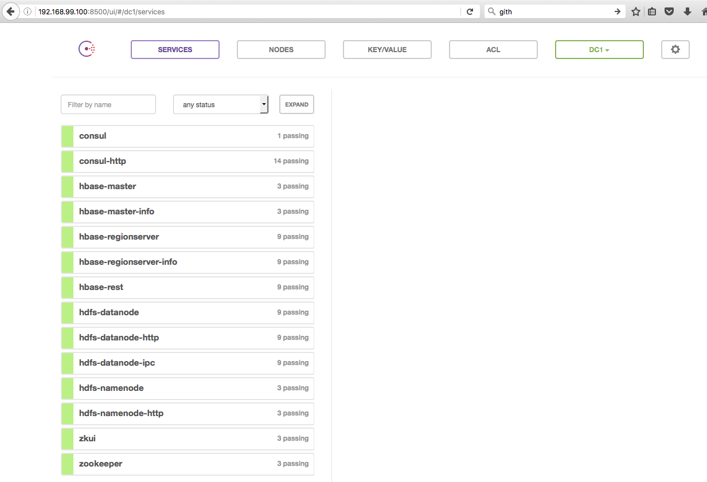
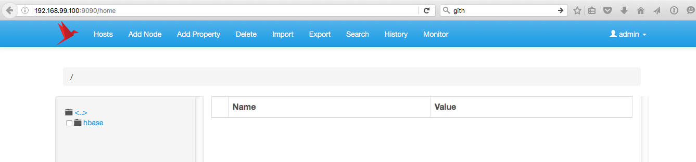

# alpn-hbase
Alpine image with HBase

## Hello World

### HDFS

For getting to know HDFS, please have a look at [qnib/alpn-hdfs](https://github.com/qnib/alpn-hdfs/blob/master/README.md).

### HBase

Fire up the stack...

```
➜  alpn-hbase git:(master) docker-compose up -d                                                                                                                                                                          git:(master|)
Creating consul
Creating hbase
Creating hbase-data2
Creating zookeeper
Creating zkui
Creating hbase-data1
Creating hdfs-namenode
➜  alpn-hbase git:(master) compose ps                                                                                                                                                                    git:(master|)
    Name                   Command               State                                                                             Ports
-------------------------------------------------------------------------------------------------------------------------------------------------------------------------------------------------------------------
consul          /opt/qnib/supervisor/bin/s ...   Up      0.0.0.0:8500->8500/tcp
hbase           /opt/qnib/supervisor/bin/s ...   Up      0.0.0.0:32773->16000/tcp, 0.0.0.0:32772->16010/tcp, 0.0.0.0:32771->16020/tcp, 0.0.0.0:32770->16030/tcp, 0.0.0.0:32769->16070/tcp, 0.0.0.0:32768->16080/tcp
hbase-data1     /opt/qnib/supervisor/bin/s ...   Up      0.0.0.0:32781->16020/tcp, 0.0.0.0:32780->16030/tcp, 0.0.0.0:32779->16070/tcp, 0.0.0.0:32778->16080/tcp
hbase-data2     /opt/qnib/supervisor/bin/s ...   Up      0.0.0.0:32777->16020/tcp, 0.0.0.0:32776->16030/tcp, 0.0.0.0:32775->16070/tcp, 0.0.0.0:32774->16080/tcp
hdfs-namenode   /opt/qnib/supervisor/bin/s ...   Up      0.0.0.0:50070->50070/tcp, 0.0.0.0:8020->8020/tcp
zkui            /opt/qnib/supervisor/bin/s ...   Up      0.0.0.0:9090->9090/tcp
zookeeper       /opt/qnib/supervisor/bin/s ...   Up      0.0.0.0:2181->2181/tcp
➜  alpn-hbase git:(master)
```

Wait until consul lights up green (`http://$(docker-machine ip):8500`)...



Have a look around in Zookeeper UI (`http://$(docker-machine ip):9090`, admin/admin)... 



## Stuck here

And fail on the `base` command... :(

```
➜  alpn-hbase git:(master) docker exec -ti hbase-data1 bash
bash-4.3# /opt/hbase/bin/hbase shell
2016-05-24 18:31:37,558 WARN  [main] util.NativeCodeLoader: Unable to load native-hadoop library for your platform... using builtin-java classes where applicable
HBase Shell; enter 'help<RETURN>' for list of supported commands.
Type "exit<RETURN>" to leave the HBase Shell
Version 1.2.1, r8d8a7107dc4ccbf36a92f64675dc60392f85c015, Wed Mar 30 11:19:21 CDT 2016

hbase(main):001:0> status

ERROR: org.apache.hadoop.hbase.PleaseHoldException: Master is initializing
	at org.apache.hadoop.hbase.master.HMaster.checkInitialized(HMaster.java:2268)
	at org.apache.hadoop.hbase.master.MasterRpcServices.getClusterStatus(MasterRpcServices.java:776)
	at org.apache.hadoop.hbase.protobuf.generated.MasterProtos$MasterService$2.callBlockingMethod(MasterProtos.java:55652)
	at org.apache.hadoop.hbase.ipc.RpcServer.call(RpcServer.java:2180)
	at org.apache.hadoop.hbase.ipc.CallRunner.run(CallRunner.java:112)
	at org.apache.hadoop.hbase.ipc.RpcExecutor.consumerLoop(RpcExecutor.java:133)
	at org.apache.hadoop.hbase.ipc.RpcExecutor$1.run(RpcExecutor.java:108)
	at java.lang.Thread.run(Thread.java:745)

Here is some help for this command:
Show cluster status. Can be 'summary', 'simple', 'detailed', or 'replication'. The
default is 'summary'. Examples:

  hbase> status
  hbase> status 'simple'
  hbase> status 'summary'
  hbase> status 'detailed'
  hbase> status 'replication'
  hbase> status 'replication', 'source'
  hbase> status 'replication', 'sink'


hbase(main):002:0>
```